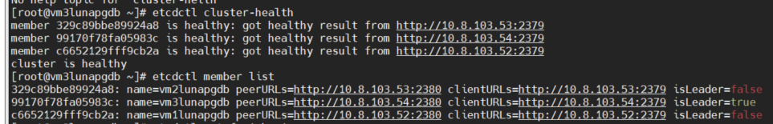
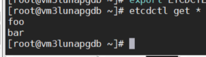
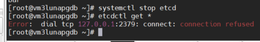
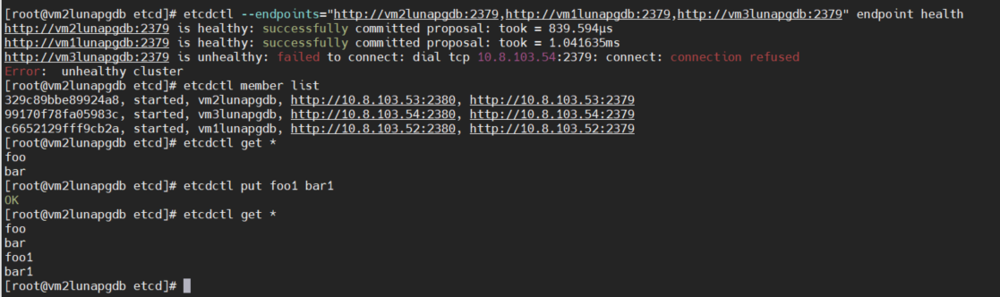

## 1) собрал кластер ETCD

## 2) добавил ключи

## 3) проверяем отказоустойчивость

#### Ломаем 3 ноду

#### Проверяем, что нода не доcтупна и состояние кластера Error:  unhealthy cluster, при этом можено добавлять и удалять данные.

